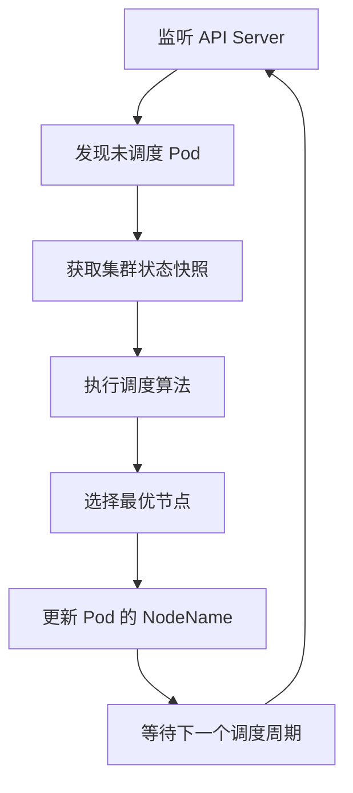
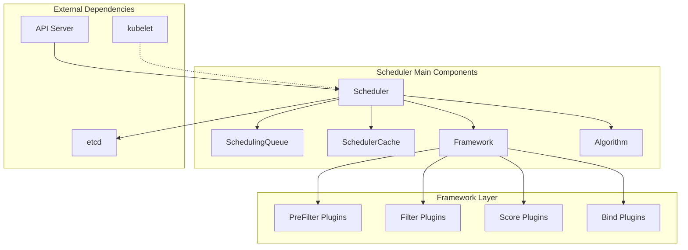
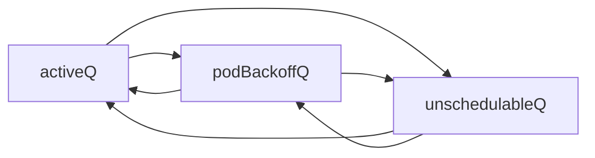
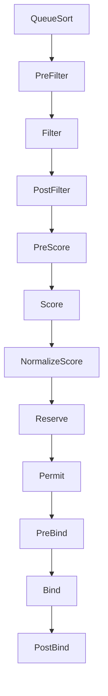

# Kubernetes Scheduler 源码深度分析

## 一、Scheduler 核心职责概述

### 1.1 什么是 Kubernetes Scheduler

Kubernetes Scheduler（kube-scheduler）是 Kubernetes 控制平面的核心组件之一，它的存在意义是**解决"在哪里运行 Pod"的问题**。

### 1.2 核心职责

#### 🎯 主要职责
1. **Pod 调度决策**：为新创建的 Pod 选择最合适的 Node
2. **资源优化**：在集群资源利用率和 Pod 需求之间找到平衡
3. **约束满足**：确保 Pod 的各种约束条件得到满足
4. **负载均衡**：在集群节点间合理分布工作负载

#### 📋 具体工作流程


#### 🔍 不负责的事情
- **不负责**实际启动 Pod（这是 kubelet 的职责）
- **不负责**容器运行时管理
- **不负责**网络配置或存储挂载
- **不负责**Pod 的生命周期管理

### 1.3 调度决策的影响因素

| 因素类型 | 具体内容 | 影响程度 |
|----------|----------|----------|
| **硬约束** | 资源需求、NodeSelector、亲和性 | 🔴 必须满足 |
| **软约束** | 偏好设置、优先级 | 🟡 尽量满足 |
| **集群状态** | 节点健康度、资源使用率 | 🟢 影响决策 |
| **调度策略** | 算法权重、插件配置 | 🔵 决策依据 |

---

## 二、源码架构深度剖析
源码结构:
```
pkg/scheduler/
├── apis/                    # API定义
│   └── config/             # 调度器配置API
├── framework/              # 调度框架核心
│   ├── interface.go        # 框架接口定义
│   ├── runtime/            # 运行时实现
│   └── plugins/            # 内置插件
├── profile/                # 调度配置文件
├── core/                   # 核心调度逻辑
├── metrics/                # 监控指标
└── testing/                # 测试工具
```
### 2.1 整体架构图



### 2.2 核心数据结构分析

#### Scheduler 主结构体
```go
// pkg/scheduler/scheduler.go
type Scheduler struct {
    // 调度缓存：存储集群状态快照
    SchedulerCache internalcache.Cache
    
    // 核心算法：实现调度决策逻辑
    Algorithm core.ScheduleAlgorithm
    
    // 配置文件：支持多配置文件调度
    Profiles profile.Map
    
    // Pod 获取函数：从队列获取待调度 Pod
    NextPod func() *v1.Pod
    
    // 错误处理函数
    Error func(*v1.Pod, error)
    
    // 调度队列：管理待调度 Pod
    SchedulingQueue internalqueue.SchedulingQueue
    
    // 停止信号
    StopEverything <-chan struct{}
}
```

#### Framework 接口设计
```go
// pkg/scheduler/framework/interface.go
type Framework interface {
    // 队列排序插件
    QueueSortPlugin() QueueSortPlugin
    
    // 预过滤阶段插件
    PreFilterPlugins() []PreFilterPlugin
    
    // 过滤阶段插件 
    FilterPlugins() []FilterPlugin
    
    // 后过滤阶段插件
    PostFilterPlugins() []PostFilterPlugin
    
    // 预打分阶段插件
    PreScorePlugins() []PreScorePlugin
    
    // 打分阶段插件
    ScorePlugins() []ScorePlugin
    
    // 预留资源插件
    ReservePlugins() []ReservePlugin
    
    // 许可插件（支持异步调度）
    PermitPlugins() []PermitPlugin
    
    // 预绑定插件
    PreBindPlugins() []PreBindPlugin
    
    // 绑定插件
    BindPlugins() []BindPlugin
    
    // 后绑定插件
    PostBindPlugins() []PostBindPlugin
}
```

### 2.3 调度队列设计

调度队列是调度器的"待办事项列表"，采用三层队列设计：

```go
// pkg/scheduler/internal/queue/scheduling_queue.go
type PriorityQueue struct {
    // 活跃队列：准备调度的 Pod（优先级堆）
    activeQ *heap.Heap
    
    // 退避队列：调度失败需要重试的 Pod
    podBackoffQ *heap.Heap
    
    // 不可调度队列：当前无法调度的 Pod
    unschedulableQ *UnschedulablePodsMap
    
    // 移动请求：在队列间移动 Pod 的请求
    moveRequestCycle int64
}
```

**队列状态转换**：


---

## 三、调度算法核心实现

```
1. 获取待调度Pod
    ↓
2. 预选阶段 (Filtering)
    ├── PreFilter 插件
    ├── Filter 插件 (节点过滤)
    └── PostFilter 插件
    ↓
3. 优选阶段 (Scoring)
    ├── PreScore 插件
    ├── Score 插件 (节点打分)
    └── NormalizeScore
    ↓
4. 绑定阶段 (Binding)
    ├── Reserve 插件
    ├── Permit 插件
    ├── PreBind 插件
    ├── Bind 插件
    └── PostBind 插件
```

### 3.1 调度主流程

调度器的核心是 `scheduleOne` 函数，它实现了完整的单次调度流程：

```go
// pkg/scheduler/scheduler.go
func (sched *Scheduler) scheduleOne(ctx context.Context) {
    // 1. 从队列获取 Pod
    podInfo := sched.NextPod()
    pod := podInfo.Pod
    
    // 2. 执行调度算法
    scheduleResult, err := sched.Algorithm.Schedule(ctx, fwk, state, pod)
    
    if err != nil {
        // 调度失败处理
        sched.recordSchedulingFailure(fwk, podInfo, err, v1.PodReasonUnschedulable, err.Error())
        return
    }
    
    // 3. 执行 Reserve 阶段
    err = sched.reserve(ctx, fwk, state, pod, scheduleResult.SuggestedHost)
    if err != nil {
        return
    }
    
    // 4. 异步执行绑定流程
    go func() {
        bindingCycleCtx, cancel := context.WithCancel(ctx)
        defer cancel()
        
        err := sched.bind(bindingCycleCtx, fwk, state, pod, scheduleResult.SuggestedHost, state)
        if err != nil {
            // 绑定失败，释放预留的资源
            fwk.RunReservePluginsUnreserve(bindingCycleCtx, state, pod, scheduleResult.SuggestedHost)
        }
    }()
}
```

### 3.2 Generic Scheduler 算法

`Generic Scheduler` 是默认的调度算法实现：

```go
// pkg/scheduler/core/generic_scheduler.go
func (g *genericScheduler) Schedule(
    ctx context.Context,
    fwk framework.Framework,
    state *framework.CycleState,
    pod *v1.Pod,
) (result ScheduleResult, err error) {
    
    // === 第一阶段：预过滤 ===
    preRes, s := fwk.RunPreFilterPlugins(ctx, state, pod)
    if !s.IsSuccess() {
        return result, s.AsError()
    }
    
    // === 第二阶段：节点过滤 ===
    filteredNodes, filteredNodesStatuses, err := g.findNodesThatFitPod(
        ctx, fwk, state, pod)
    if err != nil {
        return result, err
    }
    
    // 如果没有合适的节点，尝试抢占
    if len(filteredNodes) == 0 {
        return result, &framework.FitError{
            Pod:                   pod,
            NumAllNodes:           g.nodeInfoSnapshot.NumNodes(),
            FilteredNodesStatuses: filteredNodesStatuses,
        }
    }
    
    // === 第三阶段：节点打分 ===
    priorityList, err := g.prioritizeNodes(ctx, fwk, state, pod, filteredNodes)
    if err != nil {
        return result, err
    }
    
    // === 第四阶段：选择最优节点 ===
    host, err := g.selectHost(priorityList)
    return ScheduleResult{
        SuggestedHost:  host,
        EvaluatedNodes: len(filteredNodes) + len(filteredNodesStatuses),
        FeasibleNodes:  len(filteredNodes),
    }, err
}
```

### 3.3 节点过滤详解

节点过滤是调度的关键步骤，决定哪些节点可以运行 Pod：

```go
func (g *genericScheduler) findNodesThatFitPod(
    ctx context.Context,
    fwk framework.Framework,
    state *framework.CycleState,
    pod *v1.Pod,
) ([]*v1.Node, framework.NodeToStatusMap, error) {
    
    allNodes, err := g.nodeInfoSnapshot.NodeInfos().List()
    if err != nil {
        return nil, nil, err
    }
    
    // 并发检查节点
    numNodesToFind := g.numFeasibleNodesToFind(int32(len(allNodes)))
    
    // 创建结果收集器
    filtered := make([]*v1.Node, 0, numNodesToFind)
    filteredNodesStatuses := make(framework.NodeToStatusMap)
    
    checkNode := func(i int) {
        nodeInfo := allNodes[i]
        fits, status := g.checkNodeFits(ctx, fwk, state, pod, nodeInfo)
        if fits {
            filtered = append(filtered, nodeInfo.Node())
        } else {
            filteredNodesStatuses[nodeInfo.Node().Name] = status
        }
    }
    
    // 使用工作池并行处理
    fwk.Parallelizer().Until(ctx, len(allNodes), checkNode)
    
    return filtered, filteredNodesStatuses, nil
}
```

### 3.4 节点打分机制

节点打分为每个可用节点计算分数，分数越高表示越适合：

```go
func (g *genericScheduler) prioritizeNodes(
    ctx context.Context,
    fwk framework.Framework,
    state *framework.CycleState,
    pod *v1.Pod,
    nodes []*v1.Node,
) ([]framework.NodePluginScores, error) {
    
    // 执行 PreScore 插件
    preScoreStatus := fwk.RunPreScorePlugins(ctx, state, pod, nodes)
    if !preScoreStatus.IsSuccess() {
        return nil, preScoreStatus.AsError()
    }
    
    // 执行 Score 插件并收集分数
    scoresMap, scoreStatus := fwk.RunScorePlugins(ctx, state, pod, nodes)
    if !scoreStatus.IsSuccess() {
        return nil, scoreStatus.AsError()
    }
    
    // 构建最终结果
    result := make([]framework.NodePluginScores, len(nodes))
    for i := range nodes {
        result[i] = framework.NodePluginScores{
            Name:   nodes[i].Name,
            Scores: make([]framework.PluginScore, len(scoresMap)),
        }
        
        var totalScore int64
        for j, pluginScore := range scoresMap {
            score := pluginScore.Scores[i].Score
            result[i].Scores[j] = framework.PluginScore{
                Name:  pluginScore.Name,
                Score: score,
            }
            totalScore += score
        }
        result[i].TotalScore = totalScore
    }
    
    return result, nil
}
```

---

## 四、插件系统深入分析

### 4.1 插件生命周期

调度框架定义了 11 个扩展点，形成完整的插件生命周期：



### 4.2 关键内置插件分析

#### NodeResourcesFit 插件
负责检查节点资源是否满足 Pod 需求：

```go
// pkg/scheduler/framework/plugins/noderesources/fit.go
func (f *Fit) Filter(
    ctx context.Context,
    cycleState *framework.CycleState,
    pod *v1.Pod,
    nodeInfo *framework.NodeInfo,
) *framework.Status {
    
    // 从状态中获取预计算的资源请求
    preFilterState, err := getPreFilterState(cycleState)
    if err != nil {
        return framework.AsStatus(err)
    }
    
    // 检查资源是否足够
    insufficientResources := fitsRequest(preFilterState, nodeInfo, f.ignoredResources, f.ignoredResourceGroups)
    
    if len(insufficientResources) != 0 {
        failureReasons := make([]string, 0, len(insufficientResources))
        for _, r := range insufficientResources {
            failureReasons = append(failureReasons, r.Reason)
        }
        return framework.NewStatus(framework.Unschedulable, failureReasons...)
    }
    
    return framework.NewStatus(framework.Success, "")
}

// 资源检查的核心逻辑
func fitsRequest(podRequest *preFilterState, nodeInfo *framework.NodeInfo, ignoredExtendedResources, ignoredResourceGroups sets.String) []InsufficientResource {
    insufficientResources := make([]InsufficientResource, 0, 4)
    
    allowedPodNumber := nodeInfo.Allocatable.AllowedPodNumber
    if len(nodeInfo.Pods)+1 > allowedPodNumber {
        insufficientResources = append(insufficientResources, InsufficientResource{
            ResourceName: v1.ResourcePods,
            Reason:       "Too many pods",
            Requested:    1,
            Used:         len(nodeInfo.Pods),
            Capacity:     allowedPodNumber,
        })
    }
    
    // 检查 CPU、内存等标准资源
    if podRequest.MilliCPU == 0 && podRequest.Memory == 0 && podRequest.EphemeralStorage == 0 && len(podRequest.ScalarResources) == 0 {
        return insufficientResources
    }
    
    // 详细的资源检查逻辑...
    
    return insufficientResources
}
```

#### NodeAffinity 插件
处理节点亲和性约束：

```go
// pkg/scheduler/framework/plugins/nodeaffinity/node_affinity.go
func (pl *NodeAffinity) Filter(
    ctx context.Context,
    state *framework.CycleState,
    pod *v1.Pod,
    nodeInfo *framework.NodeInfo,
) *framework.Status {
    
    node := nodeInfo.Node()
    if node == nil {
        return framework.NewStatus(framework.Error, "node not found")
    }
    
    // 检查 requiredDuringSchedulingIgnoredDuringExecution
    if !pluginhelper.PodMatchesNodeSelectorAndAffinityTerms(pod, node) {
        return framework.NewStatus(framework.UnschedulableAndUnresolvable, ErrReasonPod)
    }
    
    return framework.NewStatus(framework.Success, "")
}

func (pl *NodeAffinity) Score(
    ctx context.Context,
    state *framework.CycleState,
    pod *v1.Pod,
    nodeName string,
) (int64, *framework.Status) {
    
    node := pl.handle.SnapshotSharedLister().NodeInfos().Get(nodeName)
    if node == nil {
        return 0, framework.NewStatus(framework.Error, fmt.Sprintf("getting node %q from Snapshot: %v", nodeName, err))
    }
    
    // 基于 preferredDuringSchedulingIgnoredDuringExecution 计算分数
    score := int64(0)
    if pod.Spec.Affinity != nil && pod.Spec.Affinity.NodeAffinity != nil {
        preferredSchedulingTerms := pod.Spec.Affinity.NodeAffinity.PreferredDuringSchedulingIgnoredDuringExecution
        for _, preferredSchedulingTerm := range preferredSchedulingTerms {
            if pluginhelper.MatchNodeSelectorTerm(node.Node(), &preferredSchedulingTerm.Preference) {
                score += int64(preferredSchedulingTerm.Weight)
            }
        }
    }
    
    return score, framework.NewStatus(framework.Success, "")
}
```

### 4.3 自定义插件开发

创建自定义插件的完整示例：

```go
package customplugin

import (
    "context"
    "fmt"
    
    v1 "k8s.io/api/core/v1"
    "k8s.io/apimachinery/pkg/runtime"
    "k8s.io/kubernetes/pkg/scheduler/framework"
)

// 插件名称常量
const CustomPluginName = "CustomPlugin"

// 插件配置结构体
type CustomPluginArgs struct {
    PreferredZone string `json:"preferredZone,omitempty"`
    Weight        int64  `json:"weight,omitempty"`
}

// 插件主结构体
type CustomPlugin struct {
    args   *CustomPluginArgs
    handle framework.Handle
}

// 插件工厂函数
func New(args runtime.Object, handle framework.Handle) (framework.Plugin, error) {
    customArgs, ok := args.(*CustomPluginArgs)
    if !ok {
        return nil, fmt.Errorf("want args to be of type CustomPluginArgs, got %T", args)
    }
    
    return &CustomPlugin{
        args:   customArgs,
        handle: handle,
    }, nil
}

// 实现插件基础接口
func (pl *CustomPlugin) Name() string {
    return CustomPluginName
}

// 实现 FilterPlugin 接口
func (pl *CustomPlugin) Filter(
    ctx context.Context,
    state *framework.CycleState,
    pod *v1.Pod,
    nodeInfo *framework.NodeInfo,
) *framework.Status {
    
    // 自定义过滤逻辑
    node := nodeInfo.Node()
    if node.Labels["zone"] == "restricted" {
        return framework.NewStatus(framework.Unschedulable, "node in restricted zone")
    }
    
    return framework.NewStatus(framework.Success, "")
}

// 实现 ScorePlugin 接口
func (pl *CustomPlugin) Score(
    ctx context.Context,
    state *framework.CycleState,
    pod *v1.Pod,
    nodeName string,
) (int64, *framework.Status) {
    
    nodeInfo, err := pl.handle.SnapshotSharedLister().NodeInfos().Get(nodeName)
    if err != nil {
        return 0, framework.AsStatus(fmt.Errorf("getting node %q from Snapshot: %w", nodeName, err))
    }
    
    node := nodeInfo.Node()
    score := int64(0)
    
    // 如果节点在首选区域，给予额外分数
    if zone, exists := node.Labels["zone"]; exists && zone == pl.args.PreferredZone {
        score = pl.args.Weight
    }
    
    return score, framework.NewStatus(framework.Success, "")
}

// 实现 ScoreExtensions 接口以支持分数标准化
func (pl *CustomPlugin) ScoreExtensions() framework.ScoreExtensions {
    return pl
}

func (pl *CustomPlugin) NormalizeScore(
    ctx context.Context,
    state *framework.CycleState,
    pod *v1.Pod,
    scores framework.NodeScoreList,
) *framework.Status {
    
    // 找到最高分数进行标准化
    var highest int64 = 0
    for _, nodeScore := range scores {
        if nodeScore.Score > highest {
            highest = nodeScore.Score
        }
    }
    
    // 标准化到 0-100 范围
    if highest > 0 {
        for i, nodeScore := range scores {
            scores[i].Score = nodeScore.Score * framework.MaxNodeScore / highest
        }
    }
    
    return framework.NewStatus(framework.Success, "")
}

// 注册插件到调度器
func init() {
    runtime.Must(framework.NewInTreeRegistry().Register(CustomPluginName, New))
}
```

---

## 五、性能优化深度分析

### 5.1 并发优化策略

#### 节点评估并发化
```go
// pkg/scheduler/framework/parallelize/parallelism.go
func (p *parallelizeImpl) Until(
    ctx context.Context,
    pieces int,
    doWorkPiece workPieceFunc,
) {
    toProcess := make(chan int, pieces)
    for i := 0; i < pieces; i++ {
        toProcess <- i
    }
    close(toProcess)
    
    if pieces < p.chunkSizeFor(pieces) {
        // 小任务量直接串行执行
        for piece := range toProcess {
            doWorkPiece(piece)
        }
        return
    }
    
    // 大任务量并发执行
    var wg sync.WaitGroup
    workers := min(pieces, p.parallelism)
    
    wg.Add(workers)
    for i := 0; i < workers; i++ {
        go func() {
            defer wg.Done()
            for piece := range toProcess {
                doWorkPiece(piece)
            }
        }()
    }
    wg.Wait()
}
```

#### 缓存优化策略
```go
// pkg/scheduler/internal/cache/cache.go
type cacheImpl struct {
    mu          sync.RWMutex
    // 使用读写锁优化并发访问
    assumedPods sets.String
    podStates   map[string]*podState
    nodes       map[string]*nodeInfoListItem
    
    // 增量更新支持
    headNode *nodeInfoListItem
    nodeTree *nodeTree
    
    // 内存池减少 GC 压力
    podPool   sync.Pool
    nodePool  sync.Pool
}

// 增量节点信息更新
func (cache *cacheImpl) UpdateNode(oldNode, newNode *v1.Node) error {
    cache.mu.Lock()
    defer cache.mu.Unlock()
    
    n, ok := cache.nodes[newNode.Name]
    if !ok {
        return fmt.Errorf("node %v is not added to scheduler cache, so cannot be updated", newNode.Name)
    }
    
    // 只更新发生变化的字段
    if !reflect.DeepEqual(oldNode.Status.Allocatable, newNode.Status.Allocatable) {
        n.info.SetNode(newNode)
        cache.nodeTree.updateNode(n.info)
    }
    
    return nil
}
```
调度器缓存用于存储集群状态，包括：
- 节点信息
- Pod信息
- 资源使用情况

### 5.2 调度延迟优化

#### Permit 插件的异步处理
```go
// pkg/scheduler/framework/runtime/framework.go
func (f *frameworkImpl) RunPermitPlugins(
    ctx context.Context,
    state *framework.CycleState,
    pod *v1.Pod,
    nodeName string,
) (status *framework.Status) {
    
    pluginsWaitTime := make(map[string]time.Duration)
    statusCode := framework.Success
    
    for _, pl := range f.permitPlugins {
        status, timeout := pl.Permit(ctx, state, pod, nodeName)
        if !status.IsSuccess() {
            if status.IsUnschedulable() {
                return status
            }
            if status.Code() == framework.Wait {
                // 插件要求等待，记录超时时间
                pluginsWaitTime[pl.Name()] = timeout
                statusCode = framework.Wait
            } else {
                return status
            }
        }
    }
    
    // 如果有插件要求等待，创建等待 Pod
    if statusCode == framework.Wait {
        waitingPod := &waitingPod{
            pod:            pod,
            pendingPlugins: make(map[string]*time.Timer),
            s:              make(chan *framework.Status, 1),
        }
        
        // 为每个需要等待的插件设置超时
        for pluginName, timeout := range pluginsWaitTime {
            waitingPod.pendingPlugins[pluginName] = time.AfterFunc(timeout, func() {
                waitingPod.s <- framework.NewStatus(framework.Unschedulable, 
                    fmt.Sprintf("rejected pod %q by permit plugin %q", pod.Name, pluginName))
            })
        }
        
        f.waitingPods.add(waitingPod)
        return framework.NewStatus(framework.Wait, "")
    }
    
    return framework.NewStatus(statusCode, "")
}
```

### 5.3 内存优化

#### 对象池化减少 GC
```go
// pkg/scheduler/internal/queue/scheduling_queue.go
type PriorityQueue struct {
    // 对象池减少内存分配
    podInfoPool sync.Pool
    
    // 使用 heap 而非 slice 减少内存操作
    activeQ     *heap.Heap
    podBackoffQ *heap.Heap
}

func (p *PriorityQueue) getPodInfo() *framework.QueuedPodInfo {
    if obj := p.podInfoPool.Get(); obj != nil {
        return obj.(*framework.QueuedPodInfo)
    }
    return &framework.QueuedPodInfo{}
}

func (p *PriorityQueue) putPodInfo(podInfo *framework.QueuedPodInfo) {
    // 清理对象后放回池中
    podInfo.Pod = nil
    podInfo.Timestamp = time.Time{}
    p.podInfoPool.Put(podInfo)
}
```

---

## 六、调试与故障排除

### 6.1 常用调试技巧

#### 启用详细日志
```bash
# 启动调度器时增加日志级别
kube-scheduler \
  --config=/etc/kubernetes/scheduler-config.yaml \
  --v=4 \
  --logtostderr
```

#### 使用调度器配置文件
```yaml
apiVersion: kubescheduler.config.k8s.io/v1beta3
kind: KubeSchedulerConfiguration
profiles:
- schedulerName: detailed-scheduler
  plugins:
    filter:
      enabled:
      - name: NodeResourcesFit
      - name: NodeAffinity
    score:
      enabled:
      - name: NodeResourcesFit
        weight: 1
      - name: NodeAffinity
        weight: 2
  pluginConfig:
  - name: NodeResourcesFit
    args:
      scoringStrategy:
        type: LeastAllocated
```

#### 性能分析工具
```bash
# 启用 pprof
kubectl port-forward -n kube-system pod/kube-scheduler-master 10251:10251

# CPU 分析
curl http://localhost:10251/debug/pprof/profile?seconds=30 > scheduler-cpu.prof
go tool pprof scheduler-cpu.prof

# 内存分析
curl http://localhost:10251/debug/pprof/heap > scheduler-mem.prof
go tool pprof scheduler-mem.prof

# Goroutine 分析
curl http://localhost:10251/debug/pprof/goroutine > scheduler-goroutine.prof
go tool pprof scheduler-goroutine.prof
```

### 6.2 故障排除 Playbook

#### Pod 长期 Pending 排查
```bash
# 1. 查看 Pod 事件
kubectl describe pod <pod-name>

# 2. 检查调度器事件
kubectl get events --all-namespaces --field-selector reason=FailedScheduling

# 3. 验证节点资源
kubectl top nodes
kubectl describe nodes

# 4. 检查调度器日志
kubectl logs -n kube-system -l component=kube-scheduler --tail=100
```

#### 调度性能问题诊断
```bash
# 1. 检查调度延迟指标
curl -s http://scheduler-ip:10251/metrics | grep scheduler_scheduling_duration_seconds

# 2. 查看队列深度
curl -s http://scheduler-ip:10251/metrics | grep scheduler_pending_pods

# 3. 分析插件耗时
curl -s http://scheduler-ip:10251/metrics | grep scheduler_plugin_execution_duration_seconds

# 4. 检查调度成功率
curl -s http://scheduler-ip:10251/metrics | grep scheduler_schedule_attempts_total
```

---

## 七、高级特性深入

### 7.1 多调度器支持

Kubernetes 支持在同一集群中运行多个调度器：

```yaml
# 自定义调度器配置
apiVersion: kubescheduler.config.k8s.io/v1beta3
kind: KubeSchedulerConfiguration
profiles:
- schedulerName: custom-scheduler
  plugins:
    filter:
      enabled:
      - name: NodeResourcesFit
      - name: CustomPlugin
    score:
      enabled:
      - name: NodeResourcesFit
      - name: CustomPlugin
  pluginConfig:
  - name: CustomPlugin
    args:
      preferredZone: "zone-a"
      weight: 100
```

```yaml
# Pod 指定调度器
apiVersion: v1
kind: Pod
metadata:
  name: custom-scheduled-pod
spec:
  schedulerName: custom-scheduler
  containers:
  - name: app
    image: nginx:1.20
```

### 7.2 抢占机制详解

当高优先级 Pod 无法调度时，调度器会尝试抢占低优先级 Pod：

```go
// pkg/scheduler/framework/preemption/preemption.go
func (ev *Evaluator) Preempt(
    ctx context.Context,
    fwk framework.Framework,
    state *framework.CycleState,
    pod *v1.Pod,
    fitError *framework.FitError,
) (*framework.PostFilterResult, *framework.Status) {
    
    // 检查是否满足抢占条件
    if !PodEligibleToPreemptOthers(pod, fwk.SnapshotSharedLister().NodeInfos(), fitError) {
        return nil, framework.NewStatus(framework.Unschedulable, "Pod is not eligible for more preemption")
    }
    
    // 寻找抢占候选节点
    potentialNodes, err := ev.findCandidates(ctx, fwk, state, pod, fitError)
    if err != nil {
        return nil, framework.AsStatus(err)
    }
    
    if len(potentialNodes) == 0 {
        return nil, framework.NewStatus(framework.Unschedulable, "No preemption victims found")
    }
    
    // 选择最优的抢占方案
    bestCandidate := ev.selectBestCandidate(potentialNodes)
    if bestCandidate == nil || len(bestCandidate.Victims().Pods) == 0 {
        return nil, framework.NewStatus(framework.Unschedulable, "No preemption victims found")
    }
    
    return &framework.PostFilterResult{NominatedNodeName: bestCandidate.Name()}, framework.NewStatus(framework.Success, "")
}
```

### 7.3 调度器扩展机制

#### Scheduler Extender
外部调度器扩展允许使用 HTTP 调用外部服务：

```yaml
apiVersion: kubescheduler.config.k8s.io/v1beta3
kind: KubeSchedulerConfiguration
extenders:
- urlPrefix: "http://scheduler-extender.kube-system:80"
  filterVerb: "filter"
  prioritizeVerb: "prioritize"
  weight: 100
  nodeCacheCapable: false
  ignoredResources:
  - "example.com/foo"
  managedResources:
  - name: "example.com/bar"
    ignoredByScheduler: true
```

#### Scheduling Framework vs Extender

| 特性 | Scheduling Framework | Scheduler Extender |
|------|---------------------|-------------------|
| **性能** | 🟢 原生调用，高性能 | 🟡 HTTP 调用，有延迟 |
| **开发语言** | 🔴 仅支持 Go | 🟢 任意语言 |
| **集成复杂度** | 🟡 需要重新编译 | 🟢 独立部署 |
| **调试难度** | 🟡 需要调度器日志 | 🟢 独立日志系统 |
| **扩展点** | 🟢 11个扩展点 | 🔴 仅2个扩展点 |

---

## 八、监控与可观测性

### 8.1 关键监控指标

#### 调度延迟指标
```promql
# 调度延迟分布
histogram_quantile(0.99, 
  sum(rate(scheduler_scheduling_duration_seconds_bucket[5m])) by (le)
)

# 各个阶段耗时
scheduler_framework_extension_point_duration_seconds{
  extension_point="Filter"
}
```

#### 调度成功率指标
```promql
# 调度成功率
sum(rate(scheduler_schedule_attempts_total{result="scheduled"}[5m])) /
sum(rate(scheduler_schedule_attempts_total[5m])) * 100

# 调度失败原因分布
sum by (profile) (rate(scheduler_schedule_attempts_total{result="error"}[5m]))
```

#### 队列状态指标
```promql
# 待调度 Pod 数量
scheduler_pending_pods{queue="active"}

# 不可调度 Pod 数量  
scheduler_pending_pods{queue="unschedulable"}

# 队列操作速率
rate(scheduler_queue_incoming_pods_total[5m])
```

### 8.2 告警规则示例

```yaml
groups:
- name: scheduler.rules
  rules:
  - alert: SchedulerDown
    expr: up{job="kube-scheduler"} == 0
    for: 5m
    labels:
      severity: critical
    annotations:
      summary: "Kubernetes scheduler is down"
      
  - alert: SchedulingLatencyHigh
    expr: histogram_quantile(0.99, sum(rate(scheduler_scheduling_duration_seconds_bucket[5m])) by (le)) > 5
    for: 10m
    labels:
      severity: warning
    annotations:
      summary: "Scheduling latency is too high"
      
  - alert: PendingPodsHigh
    expr: scheduler_pending_pods{queue="active"} > 100
    for: 5m
    labels:
      severity: warning
    annotations:
      summary: "Too many pending pods in scheduler queue"
      
  - alert: SchedulingFailureRateHigh
    expr: |
      (
        sum(rate(scheduler_schedule_attempts_total{result!="scheduled"}[5m])) /
        sum(rate(scheduler_schedule_attempts_total[5m]))
      ) > 0.1
    for: 10m
    labels:
      severity: critical
    annotations:
      summary: "High scheduling failure rate detected"
```

### 8.3 分布式追踪

启用调度器的分布式追踪：

```yaml
apiVersion: kubescheduler.config.k8s.io/v1beta3
kind: KubeSchedulerConfiguration
# 启用追踪
enableContentionProfiling: true
profiles:
- schedulerName: traced-scheduler
  plugins:
    # 插件配置...
# 追踪配置
clientConnection:
  kubeconfig: "/etc/kubernetes/scheduler.conf"
  qps: 50
  burst: 100
```

---

## 九、生产环境最佳实践

### 9.1 调度器配置优化

#### 生产环境推荐配置
```yaml
apiVersion: kubescheduler.config.k8s.io/v1beta3
kind: KubeSchedulerConfiguration
parallelism: 16  # 根据集群规模调整
profiles:
- schedulerName: production-scheduler
  plugins:
    # 禁用不必要的插件以提升性能
    filter:
      disabled:
      - name: PodTopologySpread  # 如果不需要拓扑分布
    score:
      enabled:
      - name: NodeResourcesFit
        weight: 1
      - name: NodeAffinity
        weight: 1
      # 根据需要调整权重
  pluginConfig:
  - name: NodeResourcesFit
    args:
      # 使用 LeastAllocated 策略平衡资源使用
      scoringStrategy:
        type: LeastAllocated
        resources:
        - name: cpu
          weight: 1
        - name: memory
          weight: 1
```

### 9.2 集群规模调优参数

#### 大规模集群优化
```bash
# 启动参数优化
kube-scheduler \
  --config=/etc/kubernetes/scheduler-config.yaml \
  --kube-api-qps=100 \          # 增加 API 请求速率
  --kube-api-burst=200 \        # 增加突发请求数
  --leader-elect=true \         # 启用选主
  --leader-elect-lease-duration=15s \
  --leader-elect-renew-deadline=10s \
  --leader-elect-retry-period=2s \
  --parallelism=32 \            # 根据 CPU 核数调整
  --profiling=true \            # 生产环境可考虑禁用
  --v=2                         # 适中的日志级别
```

### 9.3 高可用部署

#### 多副本调度器配置
```yaml
apiVersion: apps/v1
kind: Deployment
metadata:
  name: kube-scheduler
  namespace: kube-system
spec:
  replicas: 3  # 多副本保证高可用
  selector:
    matchLabels:
      component: kube-scheduler
  template:
    metadata:
      labels:
        component: kube-scheduler
    spec:
      containers:
      - name: kube-scheduler
        image: k8s.gcr.io/kube-scheduler:v1.28.0
        command:
        - kube-scheduler
        - --config=/etc/kubernetes/scheduler-config.yaml
        - --leader-elect=true  # 启用选主确保只有一个活跃实例
        - --leader-elect-resource-name=kube-scheduler
        - --leader-elect-resource-namespace=kube-system
        resources:
          requests:
            cpu: 100m
            memory: 128Mi
          limits:
            cpu: 2000m
            memory: 1Gi
        livenessProbe:
          httpGet:
            path: /healthz
            port: 10251
          initialDelaySeconds: 15
          timeoutSeconds: 15
        readinessProbe:
          httpGet:
            path: /healthz
            port: 10251
          initialDelaySeconds: 5
          timeoutSeconds: 5
```

---

## 十、关键问题思考

### 🤔 架构设计思考题

#### 1. **为什么选择插件化架构？**
- **思考方向**：
    - 单体架构的局限性是什么？
    - 插件化如何提升扩展性和可维护性？
    - 性能开销与灵活性的权衡？
- **深入分析**：
    - Framework 接口设计的优势和不足
    - 插件生命周期管理的复杂性
    - 向后兼容性的考虑

#### 2. **调度器的性能瓶颈在哪里？**
- **关键瓶颈**：
    - 节点数量增长带来的 O(n) 复杂度
    - 插件执行的累积延迟
    - API Server 交互的网络开销
- **优化思路**：
    - 如何设计更高效的过滤算法？
    - 缓存策略如何平衡一致性和性能？
    - 异步处理的边界在哪里？

#### 3. **调度决策的一致性如何保证？**
- **挑战场景**：
    - 集群状态快速变化
    - 多调度器并发调度
    - 网络分区情况处理
- **解决方案评估**：
    - Optimistic 调度的风险和收益
    - 冲突检测和回滚机制
    - 最终一致性 vs 强一致性

### 🔍 实现细节思考题

#### 4. **为什么需要三级队列设计？**
- **设计考量**：
  ```
  activeQ → podBackoffQ → unschedulableQ
  ```
    - 每个队列的职责分工
    - 状态转换的触发条件
    - 避免饥饿问题的机制

#### 5. **抢占机制的公平性如何保证？**
- **核心问题**：
    - 如何选择最优的抢占受害者？
    - 优先级相同时的决策依据？
    - 抢占链的长度控制？
- **算法分析**：
    - 贪心算法的适用性
    - 全局最优 vs 局部最优
    - 抢占成本的量化方式

#### 6. **缓存一致性如何处理？**
- **一致性挑战**：
    - 调度器本地缓存与 etcd 的差异
    - 乐观调度失败的处理
    - 缓存更新的时序问题
- **技术方案**：
    - Watch 机制的可靠性保证
    - 增量更新 vs 全量更新
    - 缓存穿透和雪崩的预防

### 🚀 扩展应用思考题

#### 7. **如何设计支持 GPU 调度的插件？**
- **技术要求**：
    - GPU 拓扑感知调度
    - 多卡 Pod 的原子性调度
    - GPU 共享和隔离策略
- **实现挑战**：
    - 资源碎片化问题
    - 调度延迟的权衡
    - 故障恢复机制

#### 8. **调度器如何适应边缘计算场景？**
- **边缘特点**：
    - 网络不稳定和高延迟
    - 资源异构性强
    - 地理位置敏感
- **适配策略**：
    - 分布式调度架构
    - 离线调度决策
    - 位置感知的调度算法

#### 9. **多租户场景下的调度隔离？**
- **隔离需求**：
    - 资源配额的精确控制
    - 调度策略的租户定制
    - 性能干扰的预防
- **设计方案**：
    - 多调度器 vs 单调度器多配置
    - 优先级和抢占的租户隔离
    - 公平性算法的设计

### 🛠️ 实践操作思考题

#### 10. **如何诊断调度性能问题？**
- **问题定位流程**：
  ```
  症状观察 → 指标分析 → 日志追踪 → 性能剖析 → 根因分析
  ```
- **工具链建设**：
    - 监控体系的完整性
    - 调试工具的有效性
    - 性能基准的建立

#### 11. **生产环境升级调度器的策略？**
- **升级风险**：
    - 调度逻辑的兼容性
    - 配置格式的变更
    - 性能回归的可能性
- **安全措施**：
    - 灰度升级策略
    - 回滚预案设计
    - 监控和告警机制

#### 12. **如何测试调度器的正确性？**
- **测试维度**：
    - 功能正确性验证
    - 性能压力测试
    - 故障注入测试
- **测试挑战**：
    - 复杂调度场景的模拟
    - 非确定性行为的测试
    - 大规模集群的测试成本

---

## 总结与学习路径

### 🎯 学习建议

1. **基础理解**：先掌握 Kubernetes 整体架构和调度基本概念
2. **源码阅读**：按照调度流程逐步深入核心源码
3. **实践验证**：通过实际场景验证理论理解
4. **扩展开发**：尝试开发自定义插件加深理解
5. **性能调优**：在真实环境中进行调优实践

### 📚 推荐资源

- **官方文档**：[Kubernetes Scheduler](https://kubernetes.io/docs/concepts/scheduling-eviction/)
- **源码仓库**：[kubernetes/kubernetes](https://github.com/kubernetes/kubernetes)
- **设计文档**：[Scheduling Framework KEP](https://github.com/kubernetes/enhancements/tree/master/keps/sig-scheduling)
- **社区讨论**：[SIG Scheduling](https://github.com/kubernetes/community/tree/master/sig-scheduling)

通过系统学习和深入实践，你将能够掌握 Kubernetes 调度器的核心原理，并具备解决复杂调度问题的能力。记住，优秀的调度器不仅需要高效的算法，更需要对业务场景的深入理解和持续的优化改进。